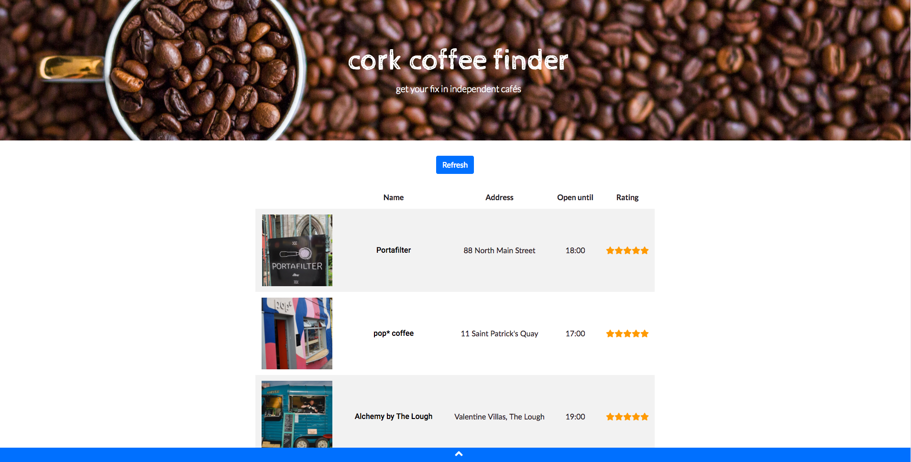

# CoffeeFinder
shows me when my favourite coffee spots are open.  
  

#### Information Source

Uses Google Places Library to get name, address, opening hours and rating from Google Maps / Google Places database.
 
To minimise API calls, the calls are made from a python script that updates a mysql database. The website queries information on opening hours & ratings from the database. The python script can be run regularly (i.e. every week) to keep the database up to date.
 
This is a curated list of cafes, based on the Ireland Independent Coffe guide and personal favourites.
 

